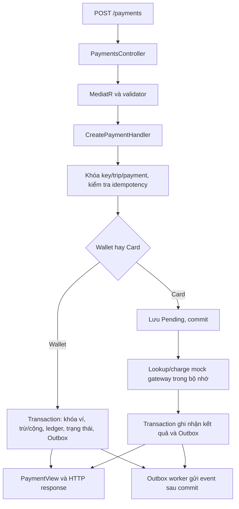

# Payment Service - Giữ schema database hiện có

Payment sử dụng các migration cũ. Không thêm PaymentProcessing, bảng GatewayOperations
hoặc cột giữ chỗ tiền/retry/đối soát. JWT và phân quyền để phần khác tích hợp sau.

## Luồng request



1. Controller nhận body và Idempotency-Key, gửi CreatePaymentCommand.
2. ValidationBehavior kiểm tra ID, VND, số tiền nguyên dương và token Card.
3. Handler khóa theo key, TripId và payment. Cùng key/dữ liệu trả payment cũ;
   cùng key khác payload hoặc cùng trip khác key trả 409.
4. Wallet: khóa các ví theo thứ tự ổn định, kiểm tra role/currency/số dư;
   trừ rider, cộng driver, ghi hai ledger, Completed và Outbox cùng transaction.
   Thiếu tiền: Failed và event thất bại; không thay đổi số dư hoặc ghi ledger.
5. Card: lưu Pending trước khi gọi mock; lookup cùng key rồi mới charge. Thành công
   thì cộng driver và ghi ledger/trạng thái/Outbox trong transaction mới. Từ chối
   thì Failed; timeout hết retry giữ Pending. Không giữ DB transaction khi gọi gateway.
6. Controller trả 201 cho payment mới thành công, 200 cho replay, 202 Pending,
   422 Failed, 400 validation và 409 conflict. Outbox gửi event sau commit,
   không cần đợi Trip nhận event để trả HTTP.

## Các thành phần

- Domain: Wallet, PaymentTransaction, LedgerEntry, Refund và validation/state guard.
- Application/Payments: command/query, validator, handler, factory và Card processor.
- Infrastructure/Persistence: repository, transaction, advisory lock PostgreSQL
  cho thao tác nghiệp vụ và row lock ví; không cần cột concurrency mới.
- Infrastructure/Gateway: singleton MockPaymentGateway, lưu kết quả charge theo key
  trong ConcurrentDictionary. Mỗi process có bộ nhớ riêng, không dùng database.
- Infrastructure/Messaging: TripDropOffConsumer dùng cùng handler với API;
  PaymentCompletedEvent/PaymentFailedEvent được lưu bằng Bus Outbox đã có sẵn.
- API: chưa yêu cầu JWT, không đọc claim hoặc kiểm tra quyền người dùng.

## Tra cứu và hoàn tiền

GET /payments/{id} gửi GetPaymentQuery; trả PaymentView hoặc 404, không trả gateway token.

POST /payments/{id}/refund nhận Reason và Idempotency-Key. Chỉ hỗ trợ Wallet:

1. Khóa refund key và payment, đọc các refund hiện có.
2. Refund Pending/Completed khác reason trả 409. Completed cùng reason trả refund cũ.
3. Kiểm tra payment Completed và driver đủ tiền, khóa ví.
4. Tạo refund toàn phần, trừ driver/cộng rider, ghi hai ledger có description Refund,
   cập nhật Refund Completed/Payment Refunded và Outbox trong cùng transaction.

Schema cũ không có Refund.IdempotencyKey: key chỉ dùng khóa khi xử lý, không nhận diện
request bền vững. Chống hoàn thành công hai lần dựa trên payment và refund đang có.
Ledger hoàn tiền liên kết PaymentId và description, chưa có RefundId.
Refund Card trả 409 vì chưa có cơ chế giữ chỗ bền vững để bảo vệ tiền driver.

## RabbitMQ

```text
TripDropOffEvent -> TripDropOffConsumer -> CreatePaymentCommand
  -> cùng validator/handler -> Outbox -> event kết quả
RefundPaymentRequestedEvent -> RefundRequestedConsumer -> RefundPaymentCommand
  -> hoàn Wallet -> PaymentRefundedEvent
```

TripId là key payment của luồng message. CorrelationId đầu vào được dùng cho trace;
event kết quả dùng payment IdempotencyKey làm correlation ổn định, chưa giữ nguyên
CorrelationId gốc qua restart vì bảng payment cũ không có cột này.
Lỗi DB tạm thời được retry giới hạn; Pending chưa rõ kết quả đưa message vào error queue.

## Chạy và demo

Chạy infrastructure rồi API bằng .NET SDK:

```powershell
docker compose up -d
$env:PaymentDemo__Seed = 'true'
dotnet run --project src/Services/Payment/Payment.API --launch-profile http
```

Hoặc chạy API bằng Docker, không cần signing key:

```powershell
$env:PAYMENT_DEMO_SEED = 'true'
docker compose -f docker-compose.yml -f docker-compose.override.yml -f docker-compose.payment.yml up -d --build payment-api
```

API: http://localhost:5054. Seed chỉ chạy Development khi bật PaymentDemo:Seed;
ví rider 11111111-1111-1111-1111-111111111111 có số dư khởi tạo 200000,
driver 22222222-2222-2222-2222-222222222222. Không reset số dư ví đã tồn tại.
Gọi các endpoint bằng Postman để thử payment, replay và refund; không cần JWT.

Card demo dùng paymentMethod=1 và gatewayToken: mock-approved, mock-declined,
mock-timeout hoặc mock-charge-response-lost. Wallet dùng paymentMethod=0, không gửi token.
Retry Card tối đa ba lần sau lần đầu, backoff/jitter; timeout mặc định 5 giây,
cấu hình bằng PaymentGateway:TimeoutSeconds và RetryBaseMilliseconds.

## Giới hạn và database đã chạy migration mới

- Mock mất dữ liệu khi restart, không chia sẻ giữa instance; không bảo đảm chống
  charge lặp cho payment Pending sau restart. Chỉ phục vụ demo, không dùng gateway thật.
- Không lưu số lần retry, lỗi đối soát, tiền giữ chỗ hoặc key riêng của refund.
  NeedsReconciliation trong response chỉ suy ra từ Pending, không phải cột database.
- Không có refund Card, worker đối soát hoặc luồng Trip đầy đủ; không còn project test.
- Xóa file migration không tự rollback database đã áp dụng nó. Bản code này không
  xóa cột/bảng hay dữ liệu trên database của bạn. Database đã áp dụng PaymentProcessing
  cần được kiểm tra trước khi dùng; ví dụ cột Refunds.IdempotencyKey cũ còn NOT NULL
  có thể chặn INSERT refund từ bản code dùng schema cũ.
- Nếu cần phục hồi schema trên database đã áp dụng migration mới, phải dùng migration
  cũ còn đầy đủ để rollback sau khi đánh giá dữ liệu; không chạy down -v để xóa dữ liệu.

Các kết quả build/test trước đây thuộc bản có migration mới, không chứng minh bản
giữ schema cũ đã được kiểm chứng. Cần build và thử HTTP lại với database schema cũ.
